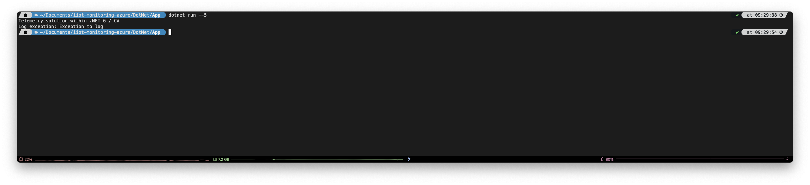
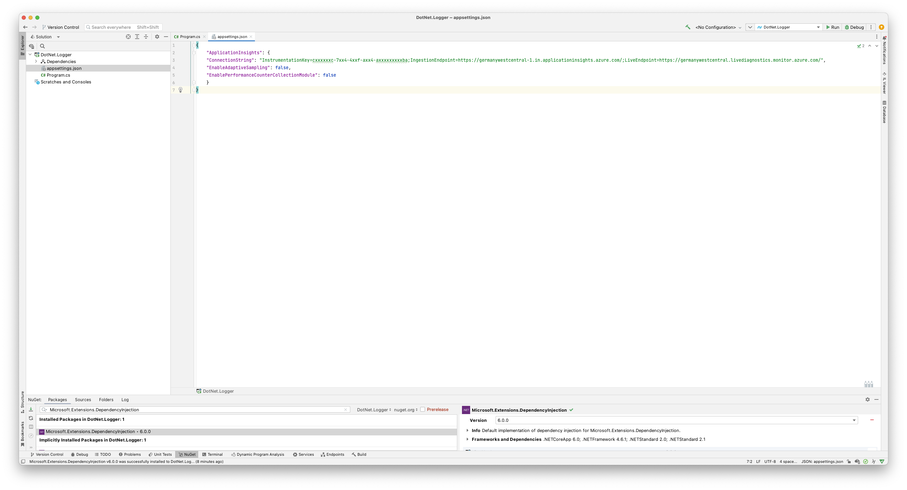
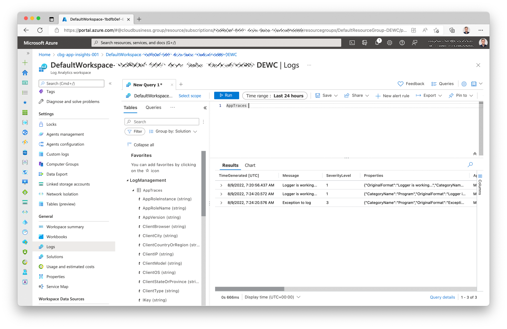

 # Simple .NET 6 solution to send telemetry data to an application insights instance

 # Getting Started

1. Install the latest [.NET 6 SDK](https://dotnet.microsoft.com/download/dotnet/6.0)
2. Open the solution and cd into it
3. Navigate to `DotNet/App` and launch the project using `dotnet run --5`
    

### Configuration

Set the InstrumentationKey within the appsettings.json:

### Checkout logs in Log Analytics workspace

Checkout the new logs within your Log Analytics workspace:

